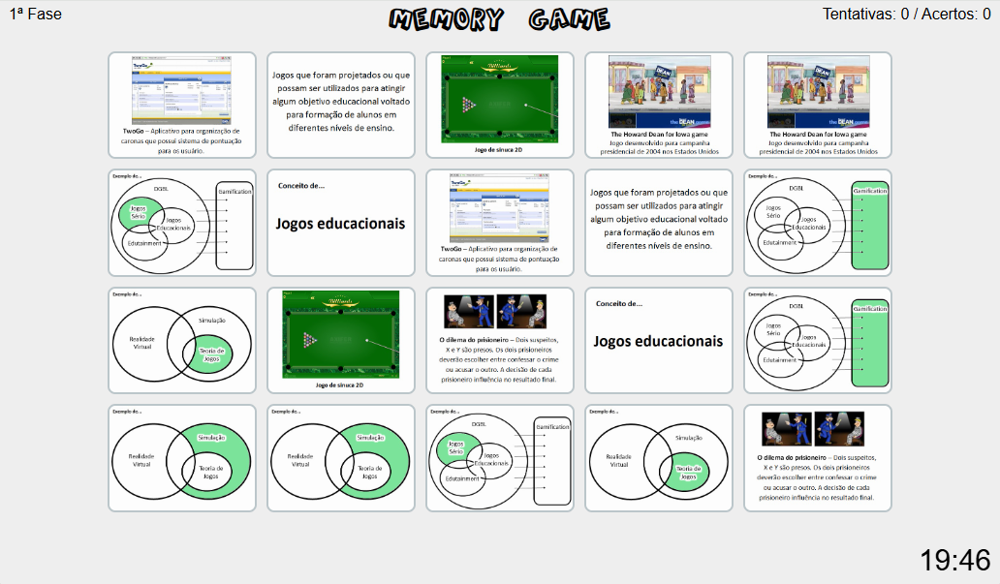

# 🎓 Artigos Acadêmicos sobre Jogos Sérios

Este repositório reúne dois artigos desenvolvidos durante o Programa de Pós-Graduação em Computação Aplicada (PPGCA) da Universidade do Estado de Santa Catarina (UDESC), com foco em definições, abordagens e classificações relacionadas a Jogos Sérios e seu uso em ambientes educacionais e de simulação.

---

## 📄 1. Abordagens Relacionadas a Jogos Sérios: Diferenças e Confusões

**Autores:** Elaine C. Cordeiro, Janaína Schwarzrock, Mayco F. de Carvalho  
📍 **UDESC – Programa de Pós-Graduação em Computação Aplicada**

### ✍️ Resumo

O artigo analisa diferentes abordagens relacionadas a Jogos Sérios, como Edutainment, DGBL, Realidade Virtual, Simulação e Gamification. Apresenta um diagrama comparativo e desenvolve um jogo da memória para fixação dos conceitos.

📎 **Arquivo:** `Abordagens_Relacionadas_a_Jogos_Sérios.pdf`

---

## 🧠 Jogo da Memória – Conceitos sobre Jogos Sérios

Este mini game foi desenvolvido como complemento ao artigo  
“Abordagens Relacionadas a Jogos Sérios: Diferenças e Confusões”.

## 🎥 Visual do Jogo



🎯 **Objetivo:** Reforçar conceitos como:
- Jogos Sérios (Serious Games)
- Edutainment
- Game-Based Learning (GBL)
- Teoria dos Jogos
- Gamificação
- Realidade Virtual e Simulação

🔧 **Tecnologias utilizadas:**  
HTML, CSS e JavaScript

📁 A pasta `jogo-da-memoria/` contém todos os arquivos necessários para execução local.

💡 Basta abrir o arquivo `index.html` no navegador para jogar.

---

## 📄 2. Análise sobre Conceitos e Definições Relacionados com Jogos Sérios

**Autores:** Elaine Cristina Cordeiro, Helder Cognaco de Oliveira, Tatiele Martins Razera  
📍 **UDESC – Programa de Pós-Graduação em Computação Aplicada**

### ✍️ Resumo

Este artigo realiza uma análise conceitual comparativa entre os termos: Jogos Sérios (JS), Jogos Educacionais (JE), Game-Based Learning (GBL), DGBL e Teoria dos Jogos (TJ). Como validação, foi criado um jogo tipo quiz para diferenciar os conceitos estudados.

📎 **Arquivo:** `ArtigoJS.pdf`

---

## 🧠 Quiz: Jogos Sérios

Este jogo interativo em formato de quiz foi desenvolvido como parte complementar ao segundo artigo, com o objetivo de testar conhecimentos sobre conceitos-chave relacionados a Jogos Sérios.

## 🎥 Visual do Jogo


### ✅ Funcionalidades

- Exibição de perguntas com múltiplas escolhas
- Sistema de pontuação automática
- Botão de dica para cada pergunta
- Mensagem de resultado final
- Estilo visual moderno e responsivo

### 💻 Tecnologias Utilizadas
- HTML
- CSS
- JavaScript

### 📂 Estrutura do Jogo

```
quiz-jogos-serios/
├── index.html       # Estrutura do jogo
├── script.js        # Lógica do quiz
└── style.css        # Estilização da interface
```

### ▶️ Como Executar

1. Clone ou baixe este repositório.
2. Navegue até a pasta do jogo.
3. Abra o arquivo `index.html` no navegador.

> O jogo pode ser executado localmente sem necessidade de instalação de dependências.

---

## 📬 Contato

📧 **elaineccordeiro@gmail.com**
